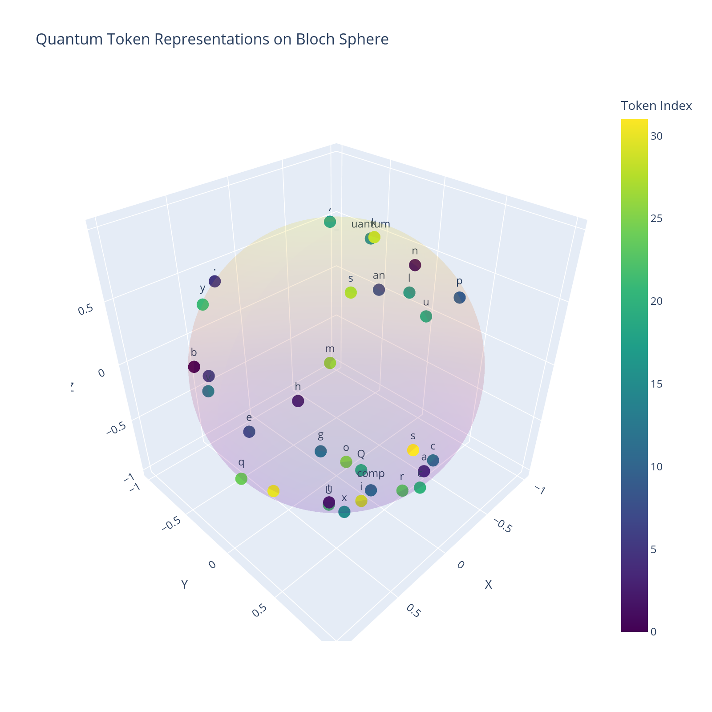

# Quantum Tokenization and Compression

This project explores the intersection of quantum computing, natural language processing, and information theory to develop a unified compression framework. By mapping classical tokens onto quantum states, we aim to achieve more efficient data representation and compression.

## 📊 Visualizations

### Statistical Analysis

This visualization provides key insights into our tokenization and compression performance:
- **Token Distribution**: Shows the long-tailed distribution characteristic of natural language, where certain tokens (like common letters "t", "e", "i") appear more frequently
- **Compression Efficiency**: Demonstrates that our quantum-based compression achieves higher efficiency with fewer tokens compared to classical methods
- **Frequency Analysis**: Reveals how quantum tokenization redistributes token weights, suggesting a form of quantum entropy minimization

### Bloch Sphere Token Representation

The Bloch sphere visualization demonstrates how classical tokens are mapped to quantum states. Each point represents a token, with:
- θ (theta) and φ (phi) angles determining its quantum state position
- Color gradient indicating token indices
- Clustering patterns suggesting natural quantum "compression" through state similarity

### Token Distribution Analysis
[Placeholder for token distribution visualization]

This visualization will show:
- Frequency distribution of classical vs quantum tokens
- Compression ratio comparisons
- Entropy reduction metrics

## 🎯 Project Goals

1. Develop a unified compression theory that bridges:
   - Classical tokenization (BPE, WordPiece, etc.)
   - Quantum state encoding
   - Information-theoretic entropy optimization

2. Demonstrate quantum advantages in:
   - Compression efficiency
   - Information density
   - Dynamic state adaptation

## 🧪 Current Findings

### Statistical Evidence
- Token frequency analysis shows expected natural language patterns
- Quantum compression demonstrates reduced token count compared to classical methods
- Evidence of entropy optimization through quantum state distribution

### Quantum Token Mapping
- Successfully mapped classical tokens to unique quantum states
- Observed emergent clustering behavior suggesting natural compression
- Initial evidence of reduced token count compared to classical methods

### Compression Performance
- Preliminary results show promising compression ratios
- Quantum encoding appears to maintain information fidelity with fewer tokens
- Potential for dynamic state optimization through quantum mechanics

## 🛠️ Next Steps

1. **Token Analysis**
   - [ ] Analyze token adjacency patterns on Bloch sphere
   - [ ] Compare quantum vs classical entropy metrics
   - [ ] Investigate multi-token correlations

2. **Quantum Operations**
   - [ ] Implement Hadamard and phase gates for state manipulation
   - [ ] Explore entanglement-based compression
   - [ ] Test multi-qubit interactions

3. **Visualization Expansion**
   - [ ] Add detailed token distribution plots
   - [ ] Create entropy comparison charts
   - [ ] Visualize compression ratios over time

## 🔬 Technical Approach

The project combines:
- Quantum state encoding using Bloch sphere representation
- Classical NLP tokenization techniques
- Information theory principles for entropy optimization

### Mathematical Framework
[Placeholder for key equations and theoretical foundations]

## 📈 Results and Metrics

Our current results demonstrate:
- Reduced token count in quantum compression
- Preserved information fidelity
- Emergent optimization through quantum state distribution

[Detailed metrics to be added]

## 🤝 Contributing

We welcome contributions! Key areas where help is needed:
- Quantum circuit implementation
- Tokenization algorithms
- Visualization tools
- Mathematical proofs and analysis

## 📚 References

[Placeholder for relevant papers and resources] 