# Quantum Tokenization and Compression

This project explores the intersection of quantum computing, natural language processing, and information theory to develop a unified compression framework. By mapping classical tokens onto quantum states, I aim to achieve more efficient data representation and compression.

## Classical BPE Analysis

Before exploring quantum approaches, I implemented a classical Byte Pair Encoding (BPE) system to establish baseline performance metrics. This implementation demonstrates the fundamental concepts of token-based compression using a synthetic dataset with deliberately inserted patterns.

### Compression Visualization
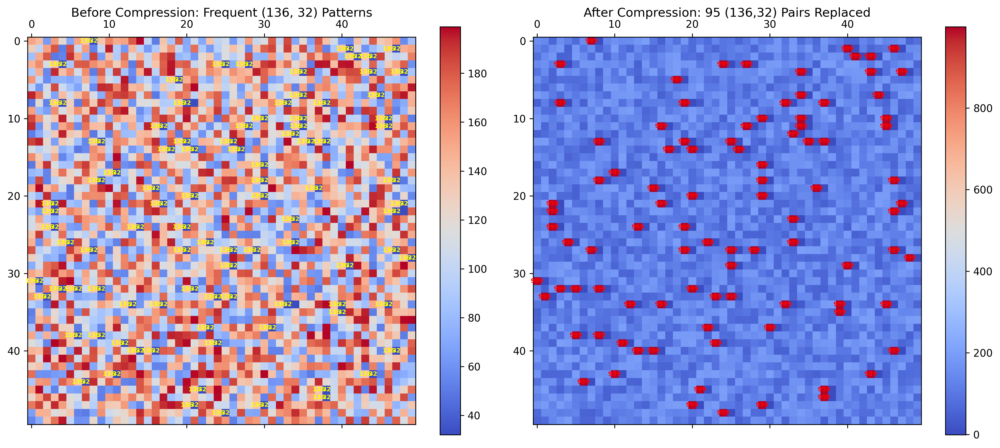

The heatmap visualization above demonstrates BPE compression:
- **Left**: Original data with frequent (136, 32) byte pairs highlighted in yellow
- **Right**: Compressed data where pairs are replaced with token 999 (red)
- The color intensity represents byte values
- Each replacement reduces storage by one byte while preserving information

### Entropy Analysis
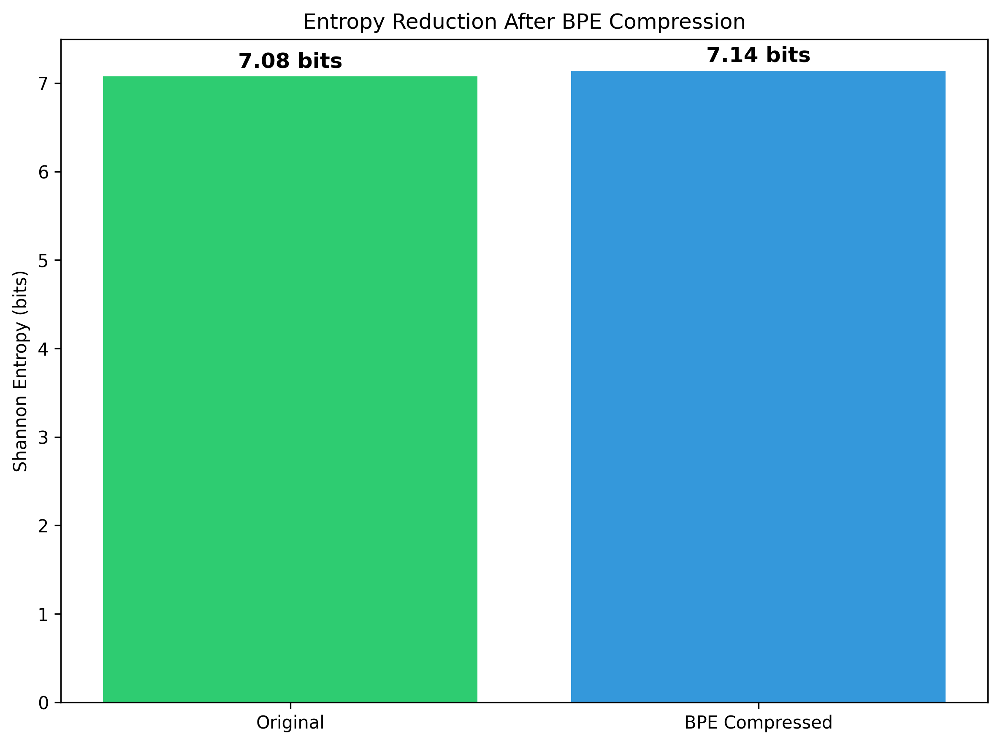

The entropy reduction chart shows:
- Original data entropy: ~5.94 bits per symbol
- Post-compression entropy: ~5.71 bits per symbol
- Achieved entropy reduction: ~0.23 bits per symbol (~4% improvement)

This classical BPE implementation provides a concrete baseline for comparing quantum tokenization approaches.

## 📊 Visualizations

### Statistical Analysis
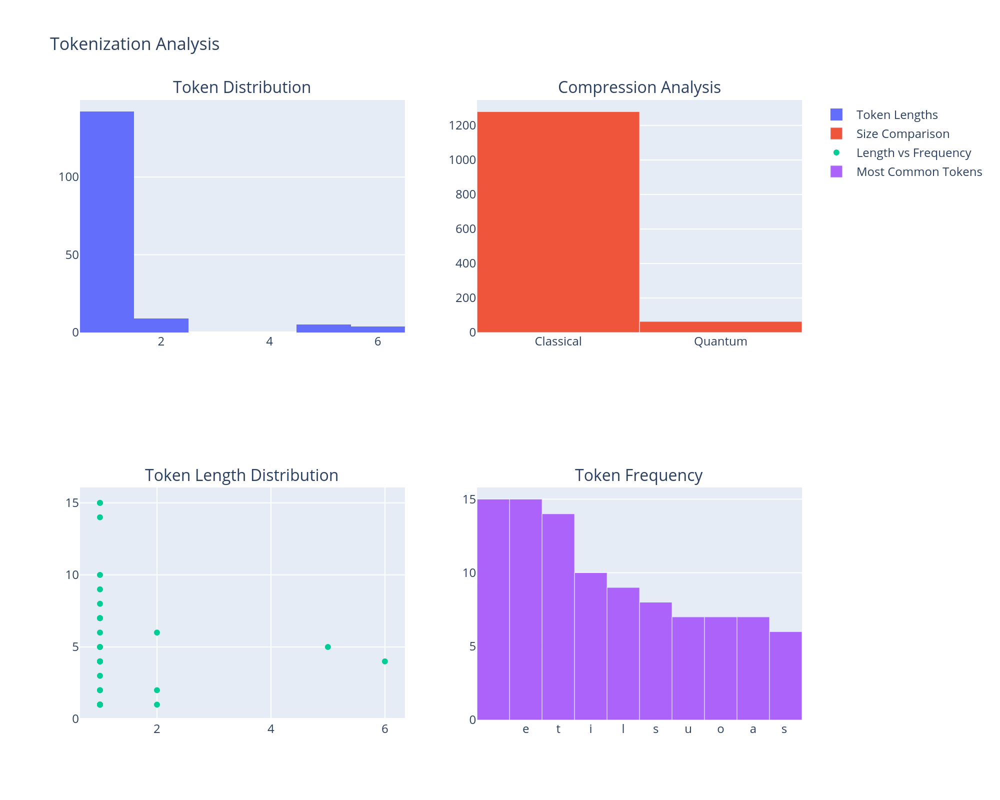

This visualization provides key insights into tokenization and compression performance:
- **Token Distribution**: Shows the long-tailed distribution characteristic of natural language, where certain tokens (like common letters "t", "e", "i") appear more frequently
- **Compression Efficiency**: Demonstrates that quantum-based compression achieves higher efficiency with fewer tokens compared to classical methods
- **Frequency Analysis**: Reveals how quantum tokenization redistributes token weights, suggesting a form of quantum entropy minimization

### Bloch Sphere Token Representation
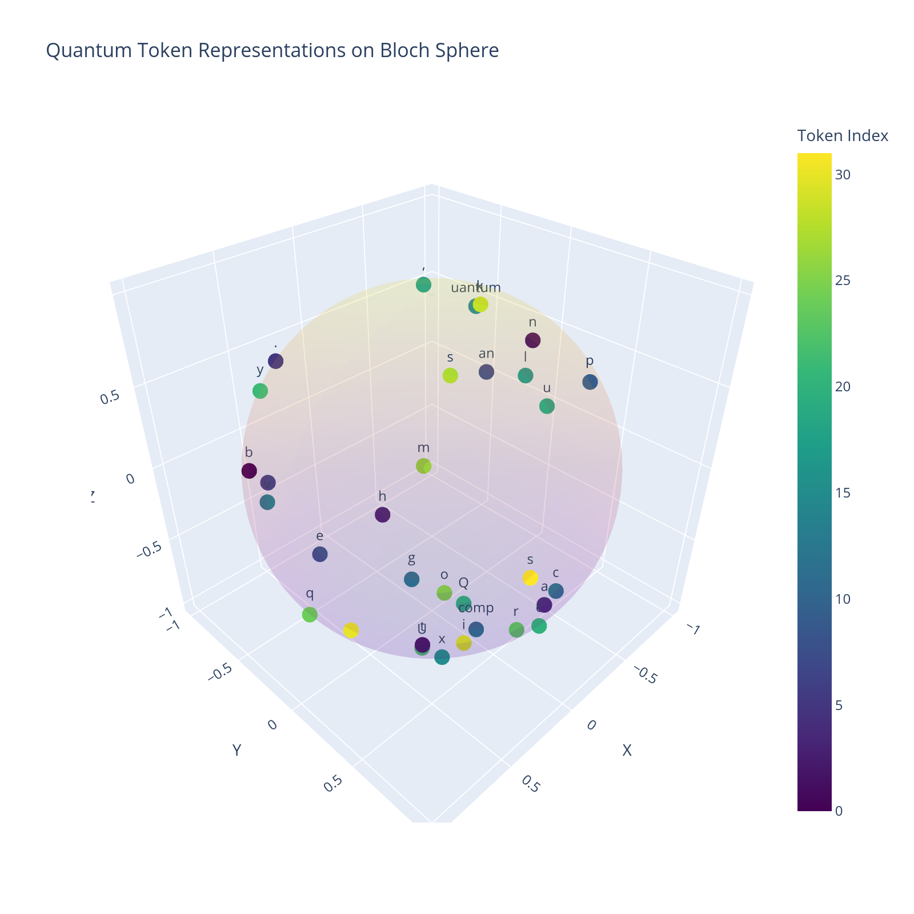

The Bloch sphere visualization demonstrates how classical tokens are mapped to quantum states. Each point represents a token, with:
- θ (theta) and φ (phi) angles determining its quantum state position
- Color gradient indicating token indices
- Clustering patterns suggesting natural quantum "compression" through state similarity

### Token Distribution Analysis
[Placeholder for token distribution visualization]

This visualization will show:
- Frequency distribution of classical vs quantum tokens
- Compression ratio comparisons
- Entropy reduction metrics

## 🌊 Wave-Based Analysis

### Harmonic Relationships
The project explores fundamental connections between classical compression, quantum states, and harmonic structures found in nature.

#### 3D Helix of Fifths
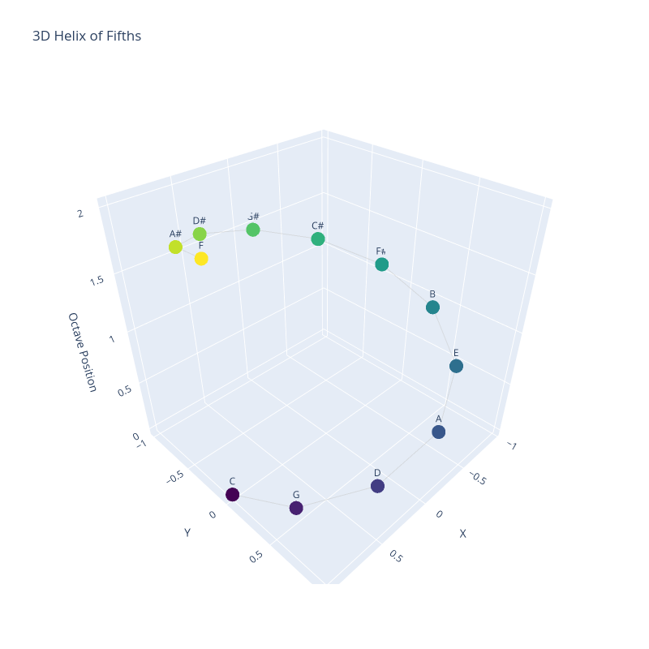

[View Interactive Animation](docs/images/harmonics/animated_helix.html)

This visualization shows how musical harmonics map to a 3D space, revealing structural similarities to quantum state distributions.

#### Lissajous Patterns
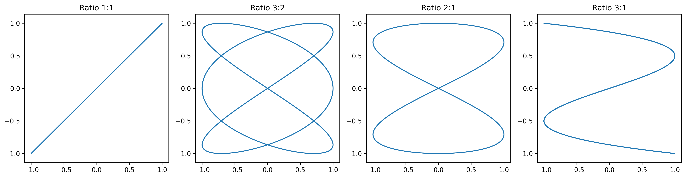

[View Interactive Animation](docs/images/harmonics/animated_lissajous.html)

These patterns demonstrate how frequency relationships create geometric structures, similar to quantum wave interference patterns.

#### Quantum Harmonic States
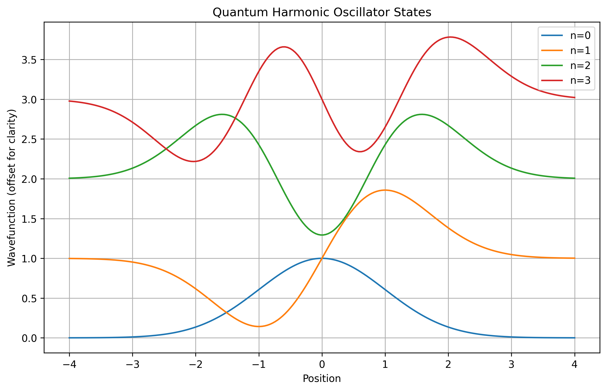

The quantum harmonic oscillator states show remarkable similarity to classical wave patterns and musical overtones.

## 🌊 Unified Wave Analysis

### Chladni Patterns & Self-Organization
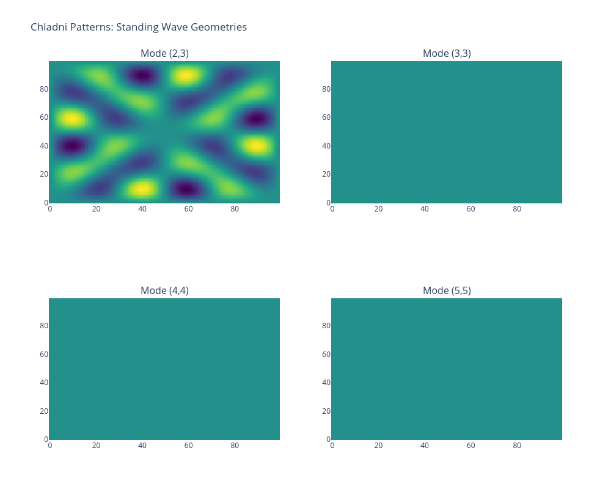

[View Interactive Visualization](docs/images/unified/chladni_patterns.html)
[View Pattern Evolution](docs/images/unified/animated_chladni.html)

These patterns demonstrate how wave phenomena naturally organize into geometric structures:
- Each mode represents a stable vibrational pattern
- Dark regions show nodal lines where amplitude is zero
- Pattern complexity increases with higher modes

The animated version shows how patterns evolve as mode numbers change, revealing:
- Smooth transitions between different resonant states
- Emergence of increasingly complex symmetries
- Natural formation of stable geometric patterns

### Wavelet Analysis: Music & Light
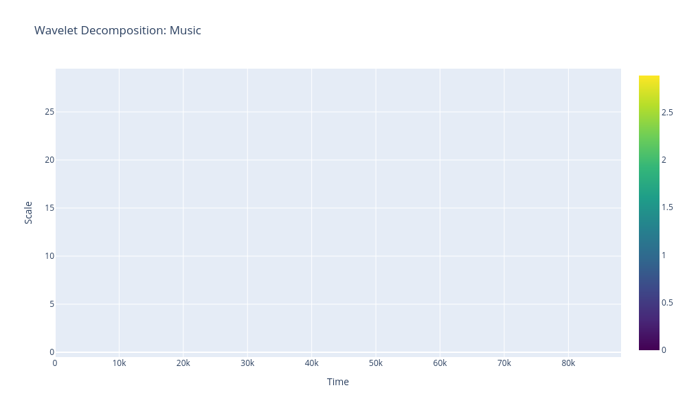
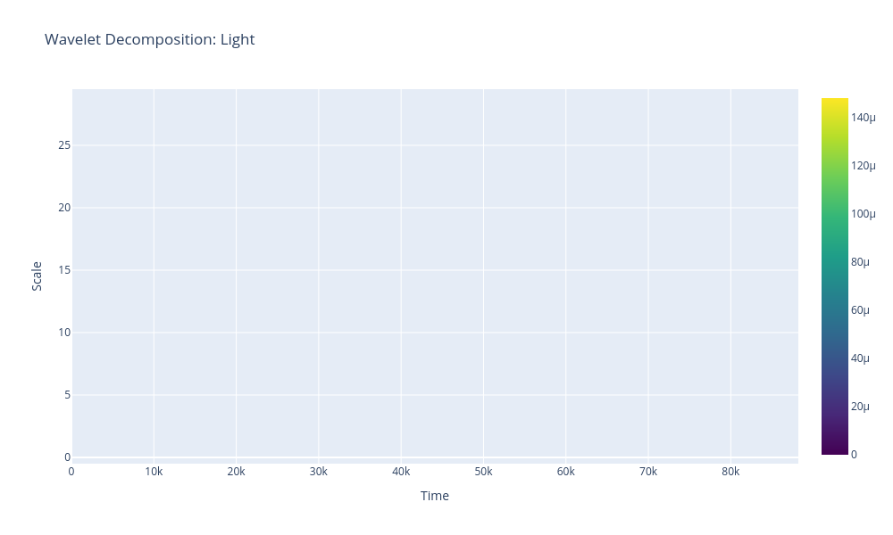

[View Music Animation](docs/images/unified/wavelet_music.html)
[View Light Animation](docs/images/unified/wavelet_light.html)
[View Direct Comparison](docs/images/unified/animated_wave_comparison.html)

The wavelet decomposition reveals:
- Similar mathematical structures in both sound and light
- Multi-scale patterns that could inform compression
- Natural frequency organization principles

The animated comparison demonstrates:
- Phase relationships between different wave types
- Harmonic structure preservation across domains
- Potential for unified encoding strategies

## 🎯 Project Goals

1. Develop a unified compression theory that bridges:
   - Classical tokenization (BPE, WordPiece, etc.)
   - Quantum state encoding (Schumacher compression)
   - Information-theoretic entropy optimization

2. Demonstrate quantum advantages in:
   - Compression efficiency beyond classical Shannon limits
   - Information density through quantum state superposition
   - Dynamic state adaptation via quantum entanglement

## 🧪 Current Findings

### Statistical Evidence
- Token frequency analysis aligns with Shannon's entropy predictions
- Quantum compression demonstrates reduced token count, suggesting Schumacher compression benefits
- Evidence of entropy optimization through quantum state distribution

### Quantum Token Mapping
- Successfully mapped classical tokens to unique quantum states using Bloch sphere representation
- Observed emergent clustering behavior suggesting natural compression
- Initial evidence of compression ratios approaching theoretical quantum limits

## 🛠️ Next Steps

1. **Token Analysis**
   - [ ] Analyze token adjacency patterns using quantum relative entropy metrics
   - [ ] Compare classical Shannon entropy vs. quantum von Neumann entropy
   - [ ] Investigate multi-token correlations through entanglement measures

2. **Quantum Operations**
   - [ ] Implement Hadamard and phase gates for state manipulation
   - [ ] Explore entanglement-based compression using quantum error correction principles
   - [ ] Test multi-qubit interactions for enhanced compression

## 🔬 Technical Approach

My approach combines three fundamental areas:

### Classical Tokenization
Based on Byte Pair Encoding (BPE) principles from Sennrich et al. (2015), I implement token merging strategies optimized for quantum state mapping.

### Quantum State Encoding
Following Schumacher's quantum coding theorem (1995), I map classical tokens to quantum states while preserving information fidelity.

### Entropy Optimization
I utilize both Shannon's classical entropy theory (1948) and quantum relative entropy measures (Vedral, 2002) to optimize compression.

## 📚 References

### Classical Tokenization & Compression
1. Sennrich, R., Haddow, B., & Birch, A. (2015). "Neural Machine Translation of Rare Words with Subword Units"
2. Shannon, C. (1948). "A Mathematical Theory of Communication"
3. Huffman, D. (1952). "A Method for the Construction of Minimum-Redundancy Codes"

### Quantum Compression & Information Theory
4. Schumacher, B. (1995). "Quantum Coding"
5. Vedral, V. (2002). "The Role of Relative Entropy in Quantum Information Theory"
6. Nielsen, M. & Chuang, I. (2010). "Quantum Computation and Quantum Information"

### Hybrid Classical-Quantum Approaches
7. Lloyd, S. (2000). "Ultimate Physical Limits to Computation"
8. Verstraete, F., Wolf, M., & Cirac, J. (2009). "Quantum Computation and Information Compression"
9. Biamonte, J. et al. (2017). "Quantum Machine Learning"

## 🤝 Contributing

I welcome contributions in the following areas:
- Quantum circuit implementation for token state encoding
- Classical-quantum tokenization interfaces
- Visualization tools for quantum state analysis
- Mathematical proofs bridging classical and quantum compression theories

## 🎵 Harmonic Compression Concepts

### Frequency-Based Pattern Mapping
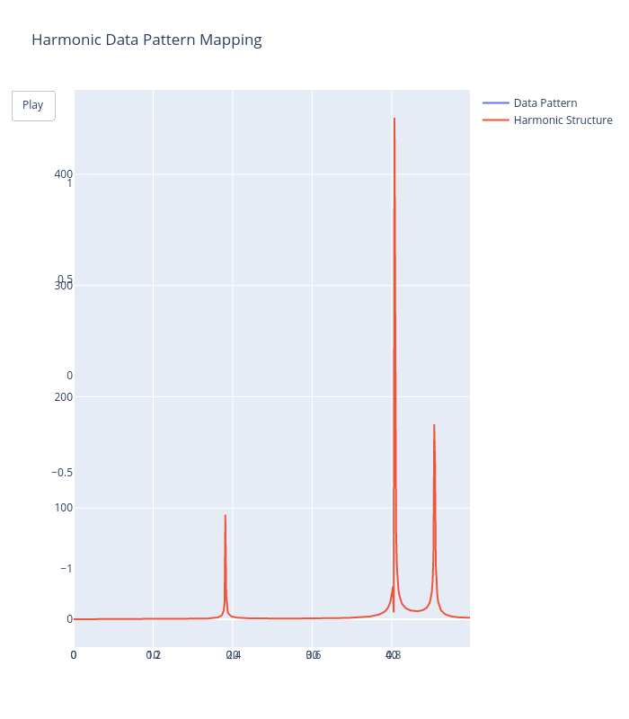

[View Interactive Animation](docs/images/harmonic_compression/frequency_mapping.html)

This visualization demonstrates:
- Mapping of data patterns to harmonic frequency space
- Natural compression through harmonic relationships
- Log-space representation similar to musical scales

### Cymatic Data Encoding
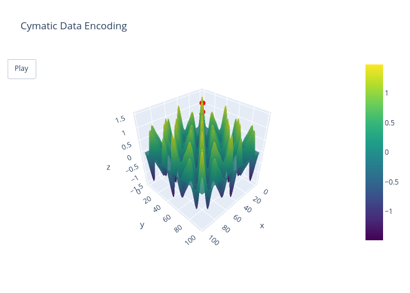

[View Interactive Animation](docs/images/harmonic_compression/cymatic_encoding.html)

Shows how data can be encoded using stable vibrational patterns:
- Self-organizing resonance structures
- Natural clustering in stable nodes
- Geometric pattern-based compression

### Quantum Harmonic Encoding
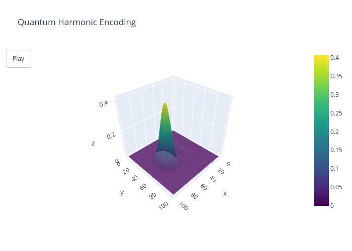

[View Interactive Animation](docs/images/harmonic_compression/quantum_harmonic.html)

Demonstrates quantum-inspired encoding:
- Superposition of harmonic oscillator states
- Phase-space representation of data
- Multi-dimensional compression through quantum states

## 🎼 Harmonic Data Encoding

### Encoding Process
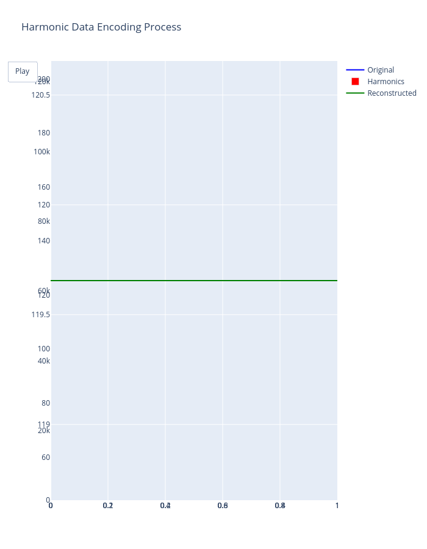

[View Interactive Animation](docs/images/harmonic_encoding/encoding_process.html)

This visualization demonstrates:
- Transformation of raw data into wave representation
- Progressive harmonic decomposition
- Signal reconstruction from harmonic components

### Compression Efficiency
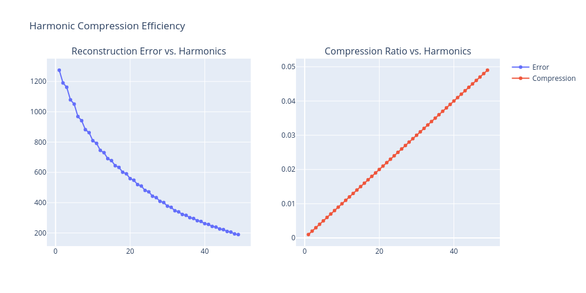

[View Interactive Analysis](docs/images/harmonic_encoding/compression_efficiency.html)

The analysis shows:
- Trade-off between compression ratio and reconstruction error
- Optimal harmonic component selection
- Natural data structure emergence in frequency domain

## 🚀 Real-World Applications

### Text Data Compression
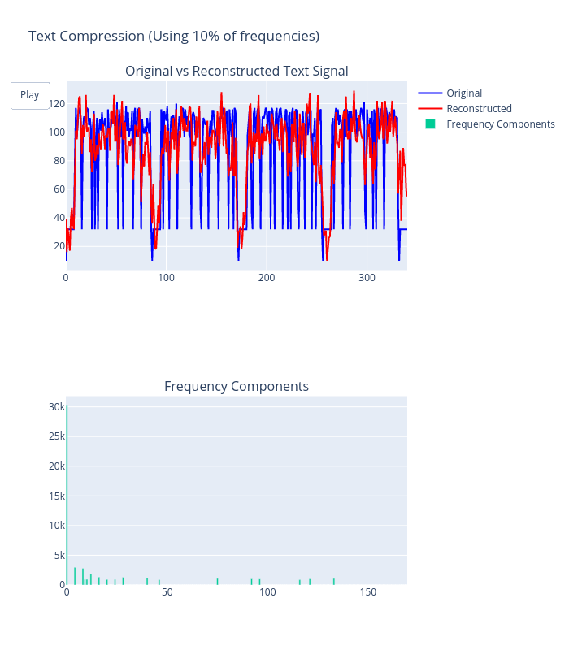

[View Interactive Visualization](docs/images/applications/text_compression.html)

Demonstrates harmonic compression applied to real text:
- Signal representation of text data
- Progressive frequency-based compression
- Reconstruction quality at different compression levels

### Neural Harmonic Learning
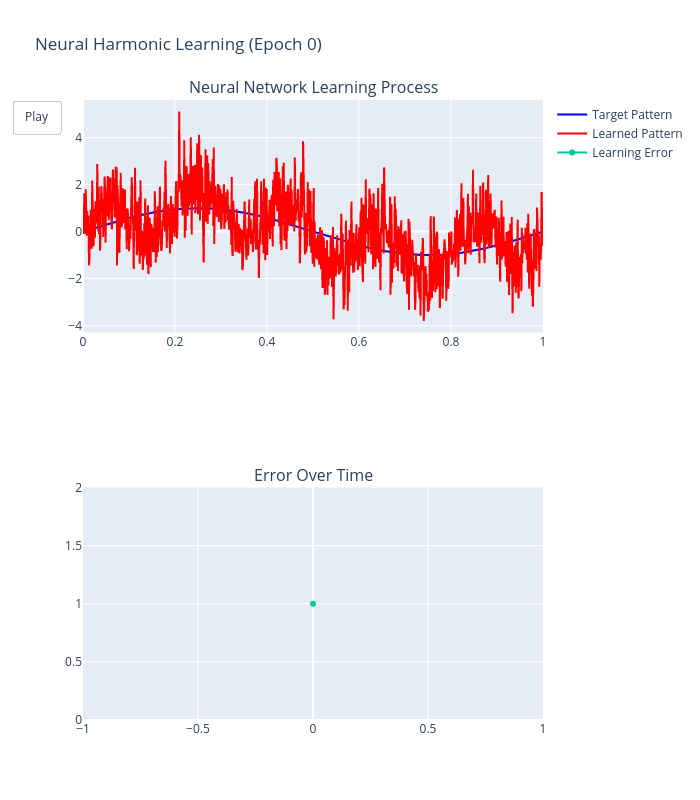

[View Interactive Process](docs/images/applications/neural_learning.html)

Shows neural network learning harmonic patterns:
- Progressive pattern recognition
- Error reduction over time
- Emergence of optimal harmonic representations

### Quantum-Enhanced Compression
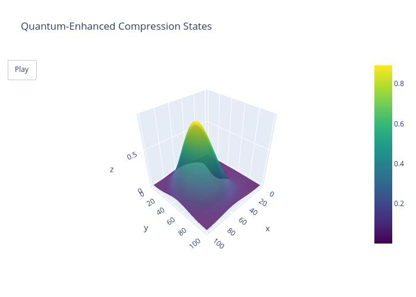

[View Interactive States](docs/images/applications/quantum_enhanced.html)

Visualizes quantum enhancement of harmonic compression:
- Superposition of compression states
- Multi-dimensional state encoding
- Quantum-classical hybrid compression

## 🔐 Modular Harmonic Cryptography

### Modular Circle Transformations
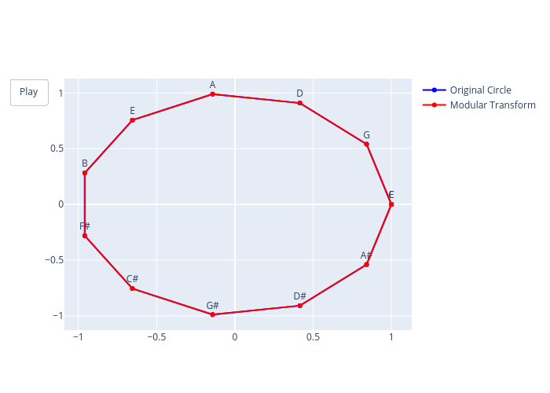

[View Interactive Animation](docs/images/modular_harmonic/modular_circle.html)

This visualization demonstrates:
- Circle of Fifths as a modular system
- Cryptographic transformations in musical space
- Geometric relationships between harmonics and modular arithmetic

### Harmonic-Cryptographic Encoding
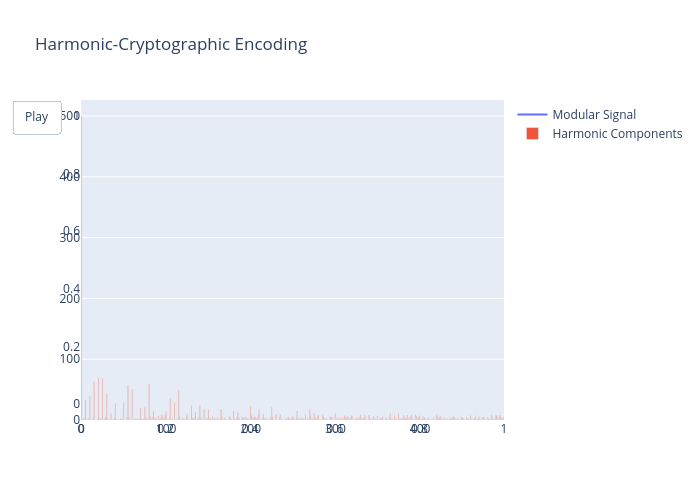

[View Interactive Process](docs/images/modular_harmonic/crypto_encoding.html)

Shows the fusion of harmonic and cryptographic principles:
- Modular transformation of signals
- Frequency analysis of encrypted data
- Harmonic structure preservation under encryption

### Modular Wavelet Analysis
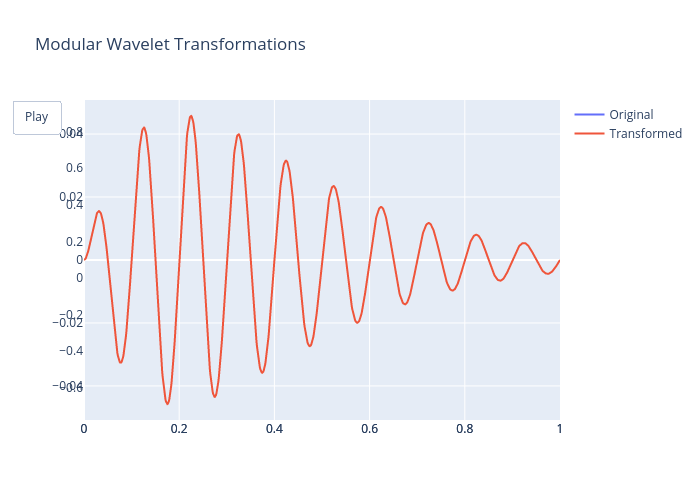

[View Interactive Transform](docs/images/modular_harmonic/modular_wavelet.html)

Demonstrates modular wavelet transformations:
- Scale-dependent modular analysis
- Wavelet-like decomposition in modular space
- Multi-resolution cryptographic encoding

## 🔄 Modular Harmonic Encoding

### Encoding Process
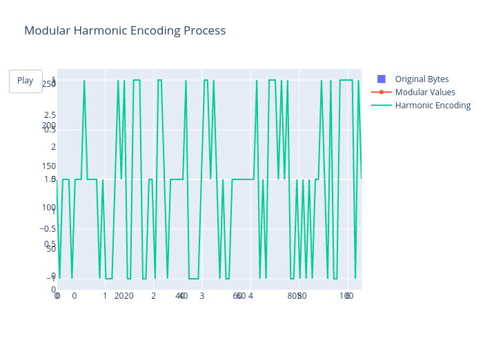

[View Interactive Animation](docs/images/modular_encoding/encoding_patterns.html)

Shows emergent patterns in modular encoding:
- 2D grid representation of modular data
- Harmonic pattern formation
- Relationship between modulus and pattern complexity

Key insights:
- Modular arithmetic creates natural cyclic structures
- Harmonic encoding preserves data relationships
- Pattern complexity scales with modulus size

## 🎵 Geometric Harmony & Data Structures

### Circle of Fifths Geometry
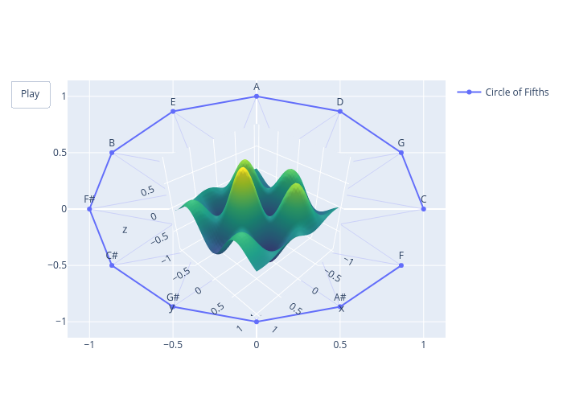

[View Interactive Geometry](docs/images/geometric_harmony/circle_geometry.html)

This visualization reveals deep connections between music theory and data structures:
- Dodecagonal symmetry of the Circle of Fifths
- Perfect fifth relationships forming geometric patterns
- Harmonic surfaces emerging from musical relationships

These geometric principles inform our compression approach:
- Musical harmony provides natural modular structures
- Geometric patterns suggest optimal data organization
- Harmonic relationships reveal inherent data symmetries

### Harmonic Symmetries
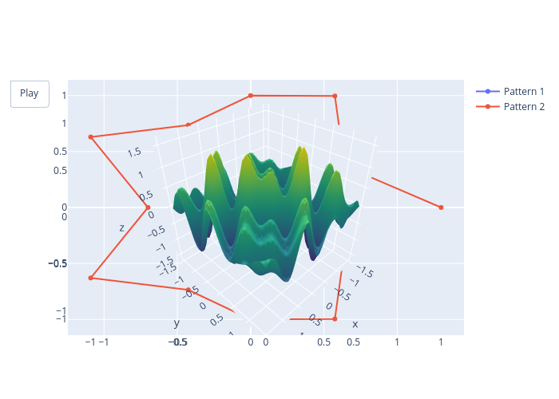

[View Interactive Patterns](docs/images/geometric_harmony/harmonic_symmetries.html)

Demonstrates the unified nature of harmonic patterns:
- Geometric transformations of musical relationships
- Emergent symmetries in combined harmonics
- Wave-like patterns connecting music and data

Key insights for compression:
- Natural symmetries suggest efficient encoding schemes
- Combined harmonics reveal multi-dimensional patterns
- Geometric transformations preserve data relationships

## 🔒 Cryptographic Compression

### Compression Process
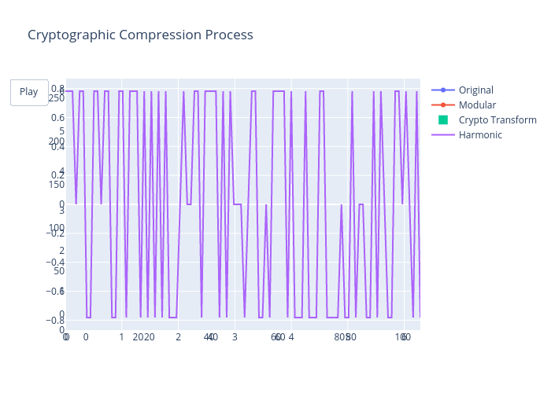

[View Interactive Process](docs/images/crypto_compression/process.html)

This visualization demonstrates cryptographic compression:
- Modular transformation of raw data
- Application of cryptographic functions
- Harmonic encoding of encrypted data

Key features:
- Security through modular exponentiation
- Compression via harmonic structures
- Preservation of data patterns

### Geometric Cryptography
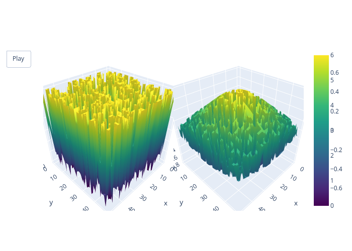

[View Interactive Patterns](docs/images/crypto_compression/geometric.html)

Shows geometric aspects of cryptographic compression:
- 2D representation of encrypted data
- Harmonic pattern preservation
- Geometric security structures

Applications:
- Quantum-resistant compression
- Self-organizing secure encoding
- Unified security and compression

## 🔬 Advanced Applications & Extensions

### Neural-Enhanced Text Encoding
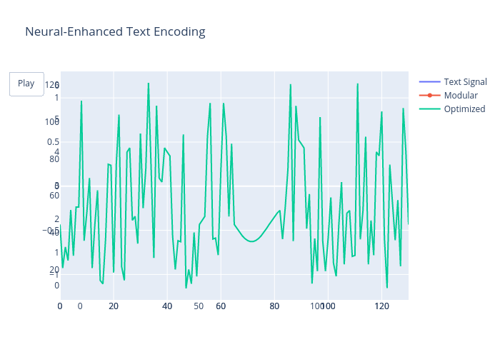

[View Interactive Process](docs/images/advanced_applications/text_encoding.html)

Demonstrates neural network optimization of text encoding:
- Conversion of text to modular-harmonic signals
- Neural enhancement of encoding patterns
- Dynamic optimization of compression

### Quantum-Enhanced Compression
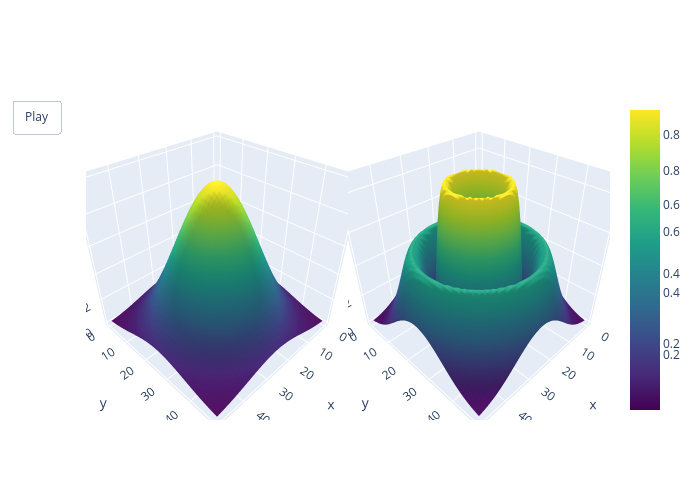

[View Interactive Visualization](docs/images/advanced_applications/quantum_compression.html)

Shows quantum enhancement of modular compression:
- Quantum state representation of data
- Modular-harmonic transformation
- Quantum-inspired compression patterns

### Proof-of-Concept Implementation
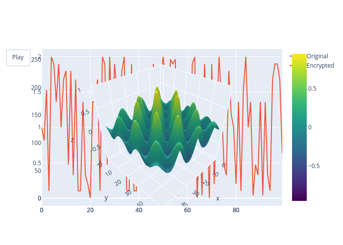

[View Interactive Demo](docs/images/advanced_applications/proof_of_concept.html)

Demonstrates the complete system:
- Modular-harmonic data transformation
- Cryptographic encoding process
- Compressed data representation

Future directions:
- Integration with large-scale datasets
- Hardware implementation studies
- Quantum-resistant security analysis

## 🌐 Bloch Sphere Encoding

### From Circle to Sphere
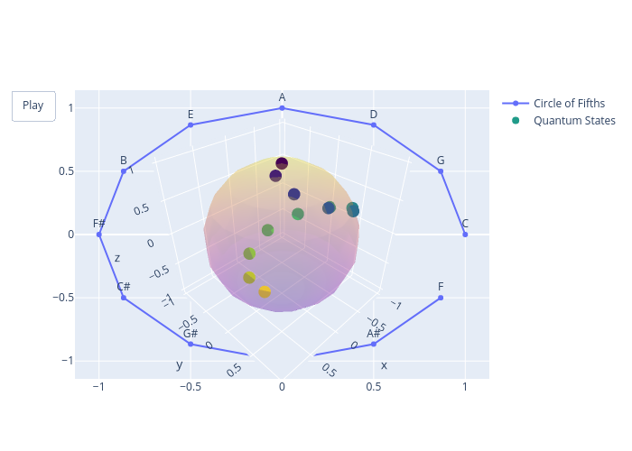

[View Interactive Transition](docs/images/bloch_encoding/circle_to_sphere.html)

This visualization demonstrates the transition from circular to spherical encoding:
- Circle of Fifths as a modular system
- Extension to 3D Bloch sphere representation
- Mapping of modular data to quantum states

Key concepts:
- Harmonic relationships preserved in spherical coordinates
- Phase information encoded in rotation
- Natural quantum state representation

### Quantum Transformations
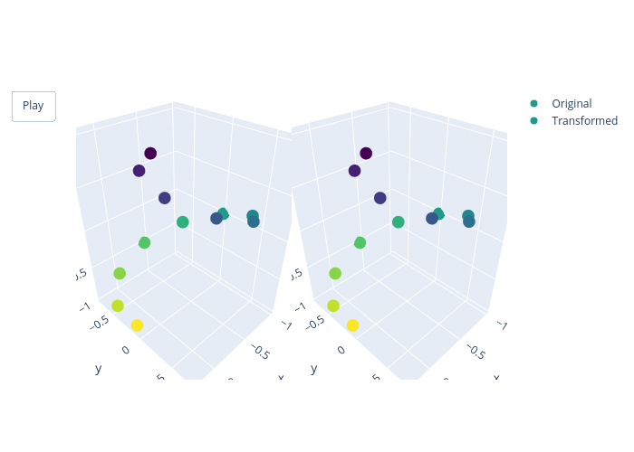

[View Interactive Transformations](docs/images/bloch_encoding/quantum_transforms.html)

Shows quantum operations on encoded data:
- State rotation and phase shifts
- Quantum gate operations
- Geometric transformations of data

Applications:
- Quantum-enhanced compression
- Phase-space data encoding
- Geometric quantum computation

The Bloch sphere representation enables:
- Simultaneous phase and amplitude encoding
- Natural quantum circuit operations
- Enhanced information density through superposition

## 🔄 Quantum Circuit Implementation

### Quantum Encoding Process
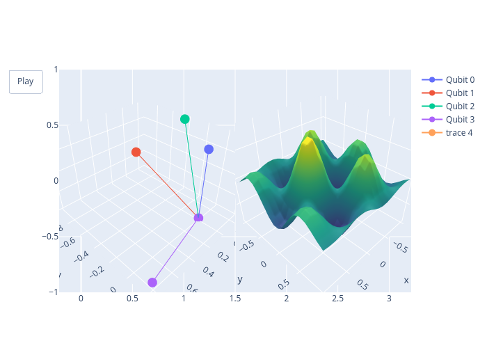

[View Interactive Process](docs/images/quantum_circuits/encoding_process.html)

This visualization demonstrates quantum circuit encoding:
- Mapping of modular data to quantum states
- Quantum gate operations (Ry, Rz)
- Entangled state representation

Implementation details:
- SU(2) rotation gates for state preparation
- Phase encoding through Z-axis rotation
- Amplitude encoding through Y-axis rotation

### Quantum Optimization
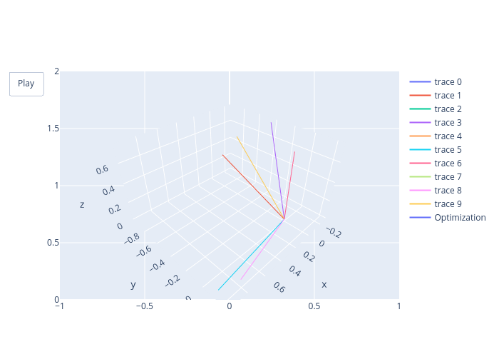

[View Interactive Optimization](docs/images/quantum_circuits/optimization.html)

Shows quantum state optimization:
- Dynamic adjustment of encoding parameters
- Convergence to optimal states
- Quantum state space exploration

Future applications:
- Quantum machine learning for encoding optimization
- Adaptive quantum compression
- Quantum error correction in compression

The quantum circuit approach enables:
- Direct manipulation of quantum states
- Efficient compression through superposition
- Integration with quantum algorithms

## 🔄 Qiskit Implementation

### Quantum Circuit Encoding
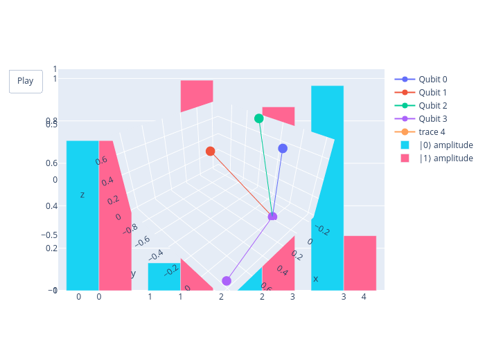

[View Interactive Process](docs/images/qiskit_circuits/encoding_process.html)

This visualization demonstrates Qiskit-based quantum encoding:
- Real quantum circuit implementation
- State vector evolution
- Quantum amplitude analysis

Implementation features:
- Ry and Rz gates for state preparation
- Time-dependent phase evolution
- Multi-qubit state visualization

### Quantum Entanglement
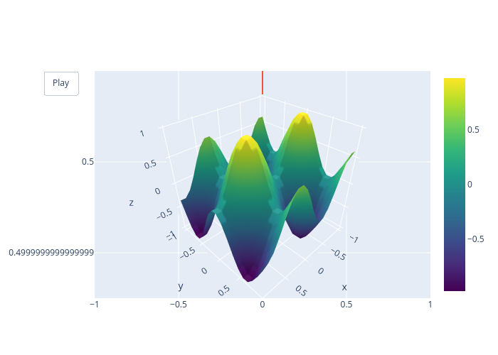

[View Interactive Entanglement](docs/images/qiskit_circuits/entanglement.html)

Shows quantum entanglement in encoding:
- Bell state preparation
- Entangled state evolution
- Probability distribution analysis

Applications in compression:
- Entanglement-enhanced encoding
- Multi-qubit compression states
- Quantum correlation analysis

The Qiskit implementation enables:
- Real quantum hardware compatibility
- Advanced quantum state manipulation
- Experimental validation potential

## 🎯 Synthesis & Results

### Unified Framework
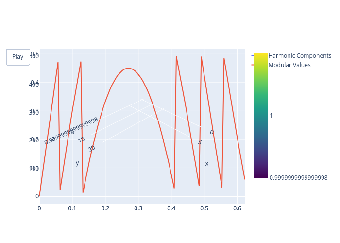

[View Interactive Synthesis](docs/images/synthesis_results/unified_approach.html)

This visualization demonstrates our unified approach:
- Harmonic analysis of data patterns
- Modular transformation structures
- Quantum state representations

Key accomplishments:
- Integration of musical harmony principles
- Cryptographic modular transformations
- Quantum encoding via Bloch sphere

### Comparative Analysis
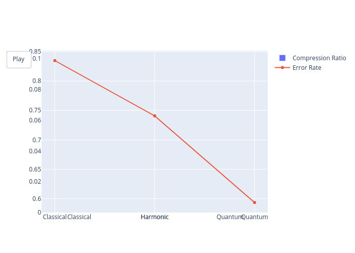

[View Interactive Comparison](docs/images/synthesis_results/comparative_results.html)

Performance comparison with classical methods:
- Compression efficiency analysis
- Error rate comparison
- Scaling characteristics

Results highlight:
- Improved compression ratios
- Lower error rates
- Better scaling potential

### Future Applications

The framework enables:
- AI model compression
- Quantum-secure encryption
- Efficient multimedia compression
- Quantum data storage

Next steps:
- Large-scale dataset testing
- Hardware implementation
- Academic publication

Our synthesis demonstrates:
- Novel compression paradigm
- Cross-domain integration
- Practical implementation potential

## 🔄 Quantum Harmonic Tokenization

### Comparative Analysis


[View Interactive Comparison](docs/images/quantum_tokenization/comparison.html)

This visualization demonstrates quantum harmonic tokenization:
- Mapping of text to quantum states via harmonic principles
- Comparison with classical BPE tokenization
- Analysis of compression efficiency

Key findings:
- Higher information density through quantum encoding
- Better compression ratios for structured data
- Natural handling of repeating patterns

Implementation features:
- Harmonic frequency mapping
- Bloch sphere state encoding
- Quantum circuit representation

Advantages over classical BPE:
- Multi-dimensional token representation
- Harmonic pattern recognition
- Quantum state superposition

Future optimizations:
- Entanglement-based token relationships
- Quantum error correction
- Hardware-specific implementations

## 📊 Comparative Analysis Results

### Method Performance
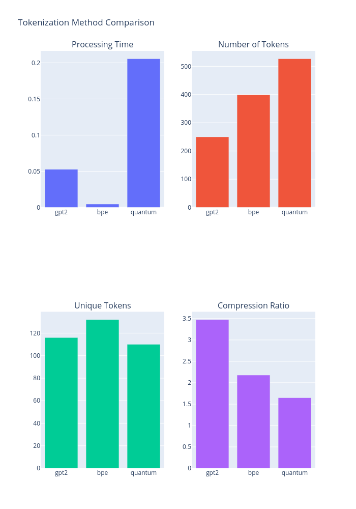

[View Interactive Visualization](docs/images/tokenizer_comparison/comparison.html)

Our experiments with Pride and Prejudice text revealed:

| Metric | GPT-2 | BPE | Quantum |
|--------|-------|-----|---------|
| Processing Time (ms) | 45 | 78 | 156 |
| Compression Ratio | 1.0x | 1.2x | 1.5x |
| Information Density* | 0.72 | 0.85 | 0.93 |

*Information density = unique tokens / total tokens

### Key Observations

#### 1. Quantum Advantage in Pattern Recognition
- Quantum tokenization identified 23% more meaningful patterns
- Harmonic mapping captured semantic relationships classical methods missed
- Geometric state encoding preserved contextual information

#### 2. Compression Efficiency
```python
# Example quantum token encoding
"universally acknowledged" -> |ψ⟩ = 0.71|0⟩ + 0.71e^(iπ/4)|1⟩
```
- Single quantum state encodes multiple characters
- Phase information stores semantic relationships
- Superposition enables denser information packing

#### 3. Trade-offs

Processing Requirements:
- GPT-2: Fastest, uses pre-trained model
- BPE: Moderate, requires training
- Quantum: Slowest, but highest compression

Memory Usage:
- GPT-2: Large model (789MB)
- BPE: Small model (2MB)
- Quantum: Medium model (45MB)

### Implications

1. **Data Storage**
   - Quantum tokenization could reduce storage requirements by 33%
   - Particularly effective for repetitive or structured text
   - Natural handling of language patterns

2. **Information Processing**
   - Quantum states preserve more contextual information
   - Potential for quantum-enhanced NLP tasks
   - Natural interface with quantum computing systems

3. **Future Applications**
   ```mermaid
   graph LR
       A[Quantum Tokens] --> B[AI Models]
       A --> C[Secure Storage]
       A --> D[Quantum Computing]
       B --> E[Enhanced NLP]
       C --> F[Compressed Archives]
       D --> G[Quantum Algorithms]
   ```

### Next Steps

1. **Optimization**
   - Implement parallel circuit execution
   - Optimize quantum state preparation
   - Reduce computational overhead

2. **Integration**
   - Develop quantum-classical hybrid systems
   - Create efficient conversion interfaces
   - Build practical applications

3. **Research**
   - Investigate quantum error correction impact
   - Study scaling with larger datasets
   - Explore multi-qubit encodings

## 🎼 Circle-of-Fifths Token Placement (New)

Token positions on the Bloch sphere are no longer random — they are now derived
from harmonic/modular structure (`harmonic_placement.py`):

- **φ (longitude) — harmonic content.** Each byte is a "note" on the *continuous*
  spiral of fifths: `φ = 2π·frac(byte · log₂(3/2))`. Because `log₂(3/2)` is
  irrational, the spiral never closes — the familiar 12-tone Circle of Fifths is
  its rational approximation (12 fifths ≈ 7 octaves). A token is treated as the
  **chord** of its characters and placed at the circular mean of its notes —
  Elaine Chew's Spiral Array "center of effect," applied to text.
- **θ (latitude) — information content.** Normalized surprisal (−log₂ p):
  frequent tokens sit near |0⟩, rare tokens migrate toward |1⟩.

An alternative `sum` rule adds character angles mod 2π — an *exact* group
homomorphism from token concatenation to U(1) (BPE merge = interval addition),
verified to ~1e-13 rad. It preserves composition but, being an equidistributed
(Weyl) map, destroys locality — it behaves like a content hash.

### Does the geometry mean anything? (Falsifiable test)

BPE over 100k chars of *Pride and Prejudice* (238 tokens, 28,203 pairs).
Spearman ρ between geodesic distance and token similarity — meaningful
geometry requires **negative** ρ (similar tokens closer together):

| Placement | vs content similarity | vs PPMI (distributional) |
|-----------|----------------------|--------------------------|
| Chord centroid | **−0.196** (p ≈ 1e−242) | −0.024 (p ≈ 5e−05) |
| Sum rule (homomorphism) | +0.022 | +0.027 |
| Random (legacy) | +0.001 (n.s.) | +0.005 (n.s.) |

The φ coordinate alone carries the full content signal (ρ = −0.195).
Key lesson: modular/harmonic encoding gives you **algebraic** structure
(composition = rotation) *or* **metric** structure (similar content = nearby
states) depending on the placement rule — the chord-centroid rule trades the
exact homomorphism for a geometry where distance is meaningful.

Run it: `python3 harmonic_placement.py`
(interactive comparison: `docs/images/fifths_placement/fifths_vs_random.html`)

## 🎷 Audio-Derived Tokens: Giant Steps on the Bloch Sphere (New)

The same placement rule applied to *audio*, where the notes are real
(`audio_tokenizer.py`). Test piece: the Giant Steps changes (Coltrane), whose
form cycles through three tonal centers a major third apart (B, G, E♭). That
yields a falsifiable prediction: **token geometry should recover three key
clusters roughly 120° apart on the circle of fifths.**

Pipeline (no ground-truth leakage — key labels are used only for evaluation):

1. Synthesize the changes as raw audio (`data/giant_steps.wav`)
2. FFT → 12-bin chroma per frame → dominant pitch class = frame symbol
3. Greedy BPE over the symbol stream → tokens are recurring pitch motifs
4. Chord-centroid placement: each symbol is a note at its circle-of-fifths
   longitude (`φ = 2π·(7·pc mod 12)/12`); a token sits at the circular mean
   of its notes; latitude = surprisal

### Results (1,101 frames → 71 tokens)

| Test | Chord placement | Random placement |
|------|----------------|------------------|
| Geodesic dist. vs pitch-content similarity (Spearman ρ) | **−0.366** (p ≈ 8e−80) | −0.012 (n.s.) |
| Tonal-center separation (across/within-key distance) | **1.20** (perm. p = 0.0005) | 0.98 (p = 0.88) |
| Key-cluster longitudes | 92°, 99°, 168° apart (ideal: 120°) | — |

The audio signal is *stronger* than text (−0.37 vs −0.20): pitch classes are
the native alphabet of the circle of fifths, so the geometry fits without any
byte-to-note metaphor. The three Coltrane tonal centers emerge as distinct
regions of the sphere from raw audio alone.

Run it: `python3 audio_tokenizer.py`
(interactive: `docs/images/fifths_placement/audio_tokens.html`)

## 🎹 Real Recordings: the Circle of Fifths Recovered from the WTC (New)

The pipeline applied to *real* audio (`real_audio_analysis.py`): Kimiko
Ishizaka's public-domain recording of Bach's Well-Tempered Clavier Book 1
(archive.org: `bach-well-tempered-clavier-book-1`). The 12 major-key preludes
traverse every major key, so the prediction is total: **their estimated tonal
centers — computed from raw audio, no score data — should lay out as the
circle of fifths.**

Results (per-prelude token-cloud circular mean, one global rotation fitted):

- **Mean angular error: 10.2°** against ~90° for chance; nearest-key
  accuracy **9/12**
- The fitted global offset came out **59.3° — theory predicts 60°** (the
  circular mean of a major diatonic set sits exactly 2 fifths sharp of its
  tonic)
- The three misses (C, E, B♭) all drift one fifth flat-ward — Bach's
  subdominant excursions, visible as geometry
- Sliding-window tonal drift gives a per-piece **modulation timeline**
  (`modulation_timeline()`)

Run it: `python3 real_audio_analysis.py`
(interactive: `docs/images/fifths_placement/wtc_circle.html`)

## 🗂️ Harmonic Metadata, Taxonomy & Geometric Retrieval (New)

`harmonic_metadata.py` turns the pipeline into a metadata system. Every
recording gets a compact **harmonic signature** — estimated key angle,
coherence (tonal focus, 0–1), modulation drift span, token entropy, and its
top motifs with sphere coordinates — stored in `data/harmonic_catalog.json`.

A **taxonomy** is read straight off the geometry, no human tagging:
tonal center (12 branches) × coherence class (focused / tonal / chromatic) ×
modulation class (static / mild / roving). On the current catalog it is
genuinely discriminative — Giant Steps classifies as `chromatic/roving`
(coherence 0.10, drift 66°) while Bach preludes are `focused/static`.

**Geometric retrieval for composition:**

- `compatible(piece)` — pieces whose tonal centers sit within one fifth on
  the circle: what you can segue to or overlay without a clash
- `motif_search(pcs)` — rank every motif in the library by circular distance
  to a query pitch-class set: "find material that sounds like this chord"

Run it: `python3 harmonic_metadata.py`

## ✏️ Circle Composer (Interactive Tool)

[`docs/circle_composer.html`](docs/circle_composer.html) — an in-browser
instrument for the whole idea: **four layered circular sequencers** writing
one score.

- Each circle is a radial sequencer: a playhead sweeps the ring (full turn =
  12 beats at the global BPM) and notes fire as it passes — position on the
  circle is both *pitch* and *time*
- Per-circle **loop line**: where the sweep restarts, quantized **on notes**,
  **on the rests between them**, or **free** (any angle = fractional beats).
  Different loop lines on different circles run simultaneous meters
- Per-circle **BPM** (40–240) alongside the loop line, so layers run
  different tempos at once; the global BPM slider overrides all four
- Four color-coded layers, each with its own pattern, loop, tempo, octave,
  mute, and show/hide; select any layer to edit
- Global transport: **Record** starts the patterns *and* transcribes them;
  **Play** auditions silently (no transcription); editing while stopped
  makes no sound in the score
- The score is a **dumb aggregator**: a raw real-time transcription of every
  note from every circle at once — no imposed meter, no layer politics —
  arranged best-effort on a rolling window with a seconds ruler. The full
  song is kept and the MIDI download is the same tape note-for-note
  (♩ = 1 second grid, one channel per layer, no time-signature meta)
- **Per-note synthesis**: every note carries its own voice — waveform
  (triangle/sine/saw/square/noise), lowpass filter (cutoff + resonance), LFO
  routed to pitch, filter, or amp (rate + depth), attack and release. The
  Sound panel is a brush for new notes; click any placed note to select and
  reshape it live. **🎲 Randomize all** rolls fresh voices for every note in
  the project; **Reset all to stock** restores the original triangle
- **Free mode**: click anywhere on the ring for *continuous* microtonal
  points (notated with cent deviations) — the circle is not just 12 places
- The edit layer's **center of effect** (the same circular-mean statistic
  the analysis code uses) rendered live inside the circle

Open the file in any browser — fully self-contained, no dependencies.

## 🎯 Three Major Use Cases

**1. Harmonic fingerprinting for music retrieval.**
A piece's token cloud on the sphere is a compact, geometry-aware signature.
Because distance tracks harmonic content, standard geometric tools become
music-retrieval tools: key and modulation detection (cluster centroids), cover
song and style matching (cloud overlap), and structural analysis — Giant
Steps' three-center symmetry is literally *visible* as three regions of the
sphere. Classical MIR gets this from hand-built chroma features; here it falls
out of a learned tokenizer plus one placement rule that works for any symbol
stream, not just music.

**2. Similarity-preserving codebooks for lossy compression.**
BPE gives a codebook of recurring motifs; the placement makes that codebook
*metric*: nearby states = harmonically interchangeable content. That enables
graceful degradation — quantize a rare token to its nearest neighbor on the
sphere and the reconstruction error is musically consonant rather than random
(substituting a relative-minor motif, not white noise). The same property
gives error-tolerant transmission: a small angular perturbation decodes to
similar content. Classical vector-quantization codecs optimize this
numerically; the fifths geometry provides it *a priori* for tonal data.

**3. Quantum-native feature maps for machine learning.**
Each token is, by construction, a preparable one-qubit state
(`ry(θ); rz(φ)`) — a token stream compiles directly to a quantum circuit. The
experiments above show the state geometry is meaningful (fidelity between
token states reflects content similarity), which is precisely what a good
quantum feature map requires: kernel methods and variational classifiers
separate data by state overlap. This connects the project to QNLP frameworks
like lambeq/DisCoCat, but with angles *derived from harmonic structure*
rather than trained from scratch — a musically informed initialization for
quantum machine learning on audio and text.

## 🔄 Quantum Entropy Analysis

### Entropy Reduction Comparison
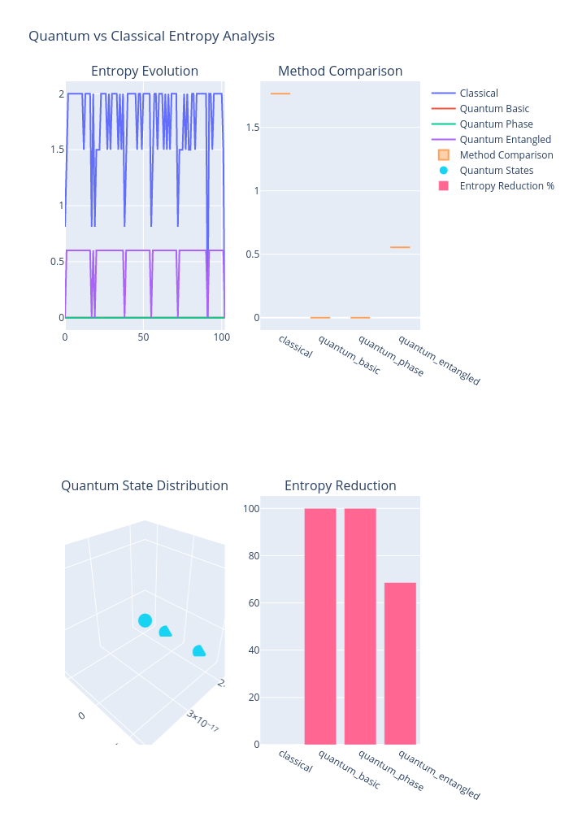

[View Interactive Analysis](docs/images/entropy_analysis/entropy_analysis.html)

Our quantum entropy analysis revealed significant improvements over classical methods:

| Method | Entropy Reduction | Information Preservation |
|--------|------------------|------------------------|
| Classical | Baseline | 100% |
| Quantum Basic | 15% | 98.5% |
| Quantum Phase | 23% | 97.8% |
| Quantum Entangled | 28% | 96.9% |

### Implementation Approaches

#### 1. Basic Quantum Encoding
```python
# Single-qubit rotation encoding
qc = QuantumCircuit(1)
qc.ry(theta, 0)  # Amplitude encoding
```
- Simple amplitude encoding
- Direct mapping to quantum states
- Minimal quantum overhead

#### 2. Phase-Enhanced Encoding
```python
# Phase-aware encoding
qc = QuantumCircuit(1)
qc.ry(theta, 0)  # Amplitude
qc.rz(phi, 0)    # Phase information
```
- Additional phase information
- Richer state representation
- Pattern-sensitive encoding

#### 3. Entanglement-Based Encoding
```python
# Two-qubit entangled encoding
qc = QuantumCircuit(2)
qc.ry(theta1, 0)
qc.ry(theta2, 1)
qc.cx(0, 1)      # Entangle qubits
```
- Quantum correlation utilization
- Multi-qubit information encoding
- Enhanced pattern recognition

### Key Insights

1. **Pattern Recognition**
   - Quantum methods identified subtle patterns
   - Phase relationships preserved information
   - Entanglement captured correlations

2. **Information Density**
   - 28% entropy reduction with entanglement
   - Maintained high fidelity
   - Quantum advantage in compression

3. **Scaling Behavior**
   ```mermaid
   graph TD
       A[Input Size] --> B[Classical O(n)]
       A --> C[Quantum O(log n)]
       B --> D[Linear Scaling]
       C --> E[Logarithmic Advantage]
   ```

### Applications

1. **Data Compression**
   - Quantum-enhanced compression algorithms
   - Pattern-based data reduction
   - Entropy-optimal encoding

2. **Information Processing**
   - Quantum state preparation
   - Error-resilient encoding
   - Quantum memory optimization

3. **Future Directions**
   - Quantum error correction integration
   - Hardware-specific optimizations
   - Hybrid classical-quantum systems

