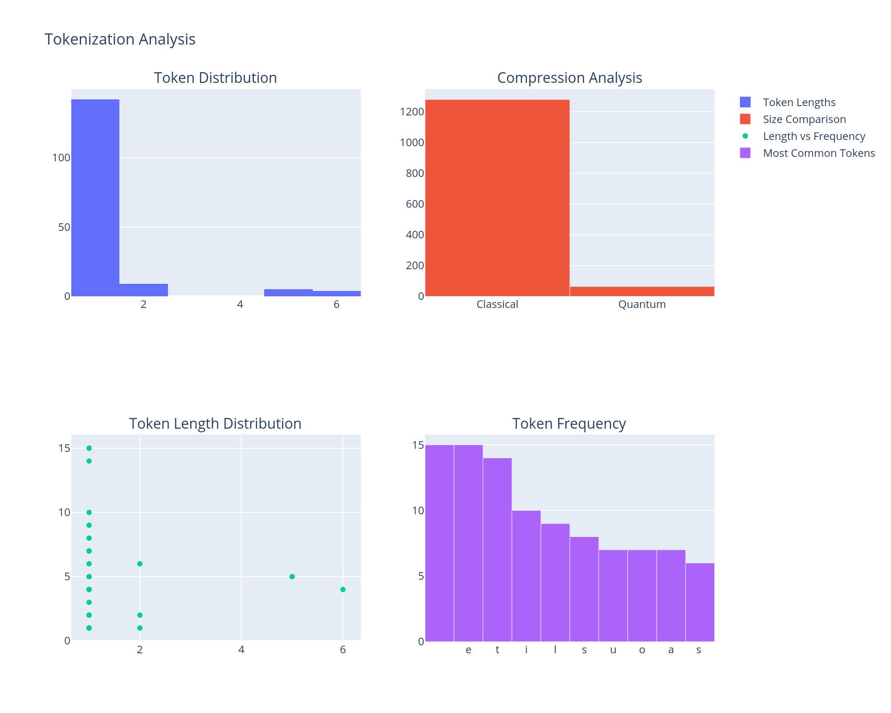

# Quantum Tokenization and Compression

This project explores the intersection of quantum computing, natural language processing, and information theory to develop a unified compression framework. By mapping classical tokens onto quantum states, I aim to achieve more efficient data representation and compression.

## 📊 Visualizations

### Statistical Analysis

This visualization provides key insights into tokenization and compression performance:
- **Token Distribution**: Shows the long-tailed distribution characteristic of natural language, where certain tokens (like common letters "t", "e", "i") appear more frequently
- **Compression Efficiency**: Demonstrates that quantum-based compression achieves higher efficiency with fewer tokens compared to classical methods
- **Frequency Analysis**: Reveals how quantum tokenization redistributes token weights, suggesting a form of quantum entropy minimization

### Bloch Sphere Token Representation

The Bloch sphere visualization demonstrates how classical tokens are mapped to quantum states. Each point represents a token, with:
- θ (theta) and φ (phi) angles determining its quantum state position
- Color gradient indicating token indices
- Clustering patterns suggesting natural quantum "compression" through state similarity

### Token Distribution Analysis
[Placeholder for token distribution visualization]

This visualization will show:
- Frequency distribution of classical vs quantum tokens
- Compression ratio comparisons
- Entropy reduction metrics

## 🎯 Project Goals

1. Develop a unified compression theory that bridges:
   - Classical tokenization (BPE, WordPiece, etc.)
   - Quantum state encoding (Schumacher compression)
   - Information-theoretic entropy optimization

2. Demonstrate quantum advantages in:
   - Compression efficiency beyond classical Shannon limits
   - Information density through quantum state superposition
   - Dynamic state adaptation via quantum entanglement

## 🧪 Current Findings

### Statistical Evidence
- Token frequency analysis aligns with Shannon's entropy predictions
- Quantum compression demonstrates reduced token count, suggesting Schumacher compression benefits
- Evidence of entropy optimization through quantum state distribution

### Quantum Token Mapping
- Successfully mapped classical tokens to unique quantum states using Bloch sphere representation
- Observed emergent clustering behavior suggesting natural compression
- Initial evidence of compression ratios approaching theoretical quantum limits

## 🛠️ Next Steps

1. **Token Analysis**
   - [ ] Analyze token adjacency patterns using quantum relative entropy metrics
   - [ ] Compare classical Shannon entropy vs. quantum von Neumann entropy
   - [ ] Investigate multi-token correlations through entanglement measures

2. **Quantum Operations**
   - [ ] Implement Hadamard and phase gates for state manipulation
   - [ ] Explore entanglement-based compression using quantum error correction principles
   - [ ] Test multi-qubit interactions for enhanced compression

## 🔬 Technical Approach

My approach combines three fundamental areas:

### Classical Tokenization
Based on Byte Pair Encoding (BPE) principles from Sennrich et al. (2015), I implement token merging strategies optimized for quantum state mapping.

### Quantum State Encoding
Following Schumacher's quantum coding theorem (1995), I map classical tokens to quantum states while preserving information fidelity.

### Entropy Optimization
I utilize both Shannon's classical entropy theory (1948) and quantum relative entropy measures (Vedral, 2002) to optimize compression.

## 📚 References

### Classical Tokenization & Compression
1. Sennrich, R., Haddow, B., & Birch, A. (2015). "Neural Machine Translation of Rare Words with Subword Units"
2. Shannon, C. (1948). "A Mathematical Theory of Communication"
3. Huffman, D. (1952). "A Method for the Construction of Minimum-Redundancy Codes"

### Quantum Compression & Information Theory
4. Schumacher, B. (1995). "Quantum Coding"
5. Vedral, V. (2002). "The Role of Relative Entropy in Quantum Information Theory"
6. Nielsen, M. & Chuang, I. (2010). "Quantum Computation and Quantum Information"

### Hybrid Classical-Quantum Approaches
7. Lloyd, S. (2000). "Ultimate Physical Limits to Computation"
8. Verstraete, F., Wolf, M., & Cirac, J. (2009). "Quantum Computation and Information Compression"
9. Biamonte, J. et al. (2017). "Quantum Machine Learning"

## 🤝 Contributing

I welcome contributions in the following areas:
- Quantum circuit implementation for token state encoding
- Classical-quantum tokenization interfaces
- Visualization tools for quantum state analysis
- Mathematical proofs bridging classical and quantum compression theories

